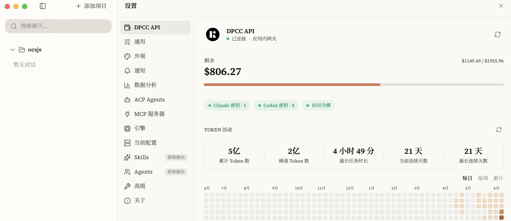
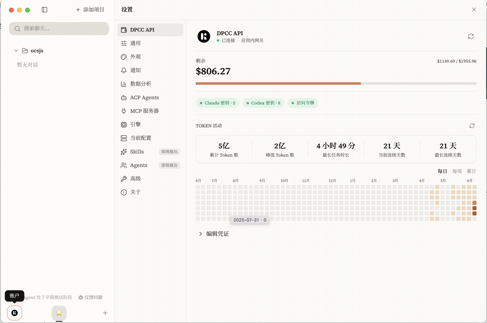
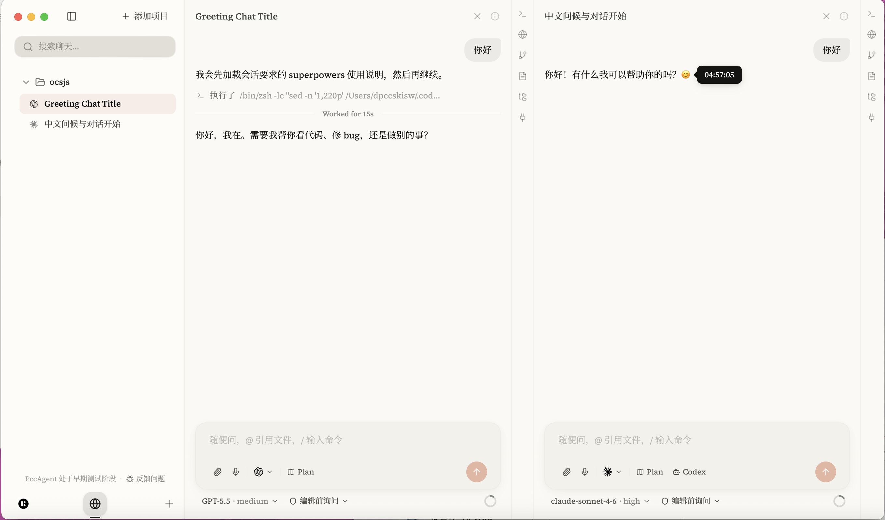
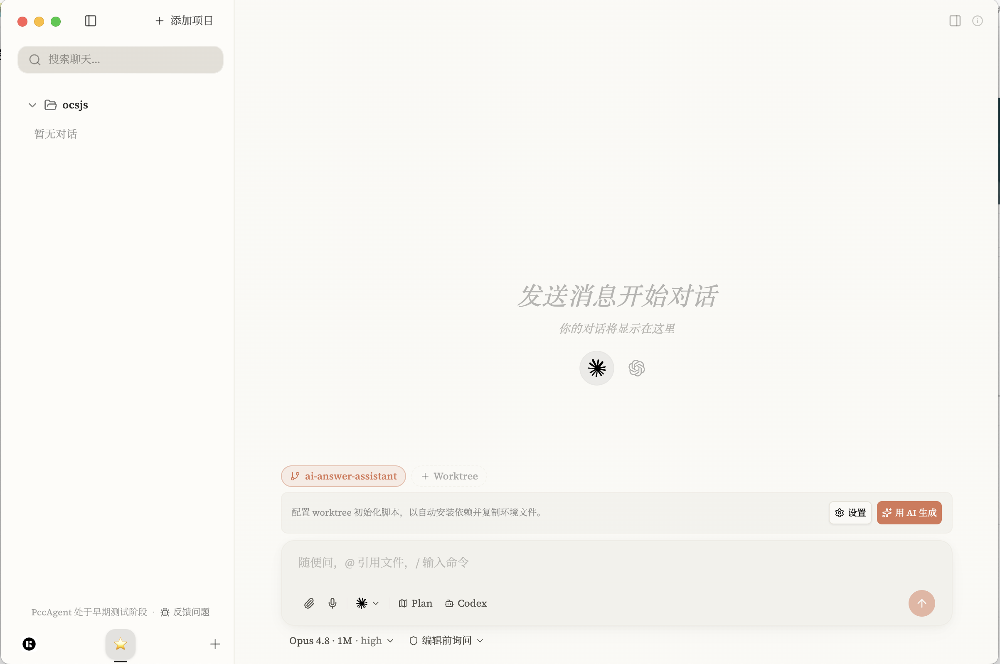

<p align="center">
  
</p>

<h1 align="center">PccAgent · DPCC API</h1>

<p align="center">
  <strong>一个桌面客户端，驾驭你的 AI 编程助手 —— 由 DPCC API 提供算力支持。</strong>
</p>

<p align="center">
  <a href="https://api.dpccgaming.xyz">DPCC API 平台</a>
  ·
  <a href="https://dpccgaming.xyz/payment">充值</a>
  ·
  <a href="docs/快速上手-连接DPCC-API.md">快速上手</a>
</p>

<p align="center">
  
  
  
</p>

> [!WARNING]
> PccAgent 仍在早期开发阶段，出现问题是正常的。欢迎在 Issues 中反馈 bug 与建议。

---

PccAgent 是一个跨平台桌面应用，让你在**同一个界面**里运行、管理并切换多种 AI 编程助手 —— Claude Code、Codex 以及任何兼容 ACP 的 agent —— 全程不丢失上下文、会话或工具状态。

所有 agent 的算力都通过你自己的 **DPCC API 网关**调用：填入网关地址与令牌即可开始，余额、模型、用量统计一目了然。

**为什么选择 PccAgent？**

- **由 DPCC API 驱动。** 一份网关凭证同时驱动 Claude 与 Codex，应用内实时查看余额、可用模型和 Token 用量。
- **一个应用，所有 agent。** Claude Code、Codex 和自定义 ACP agent 并排运行，切换工具时不再丢失上下文。
- **看清 AI 在做什么。** 工具调用渲染为可交互卡片，带词级 diff、语法高亮和内联 bash 输出 —— 而不是一堆原始 JSON。
- **你的工作区，你做主。** 内置终端、浏览器、git、MCP 服务器和文件面板，全部按项目隔离，并在工作时保持常开。

---

## 截图

<p align="center">
  
  <br />
  <em>内置 DPCC API 账户面板 —— 余额、可用模型与 Token 活动一目了然。</em>
</p>

<p align="center">
  
  <br />
  <em>设置页填入网关地址与令牌即可连接，支持精确余额与每日用量热力图。</em>
</p>

<p align="center">
  
  <br />
  <em>多个 agent 会话并排运行 —— 即时切换，不丢失进度。</em>
</p>

<p align="center">
  
  <br />
  <em>项目化工作区，配合 worktree、计划模式与 AI 答案助手。</em>
</p>

---

## 连接 DPCC API

PccAgent 不直接调用官方 Claude / Codex，而是通过你的 **DPCC API 网关**调用。第一步永远是填入**网关地址 + 令牌**，配置只保存在本机。

1. 登录 [DPCC API 平台](https://api.dpccgaming.xyz)，在「令牌 / API Key」页面新建并复制 `sk-…` 令牌。
2. 在 PccAgent 中点击侧边栏底部的**账户头像**，打开「连接你的 DPCC API 账户」引导卡片。
3. 填入**网关地址**（默认 `https://origin-api.dpccgaming.xyz`）和 **Claude / Codex 密钥**，点击「连接」。
4. （可选）补充**用户 ID + 系统访问令牌**以显示账户真实余额。

完整步骤见 **[快速上手教程](docs/快速上手-连接DPCC-API.md)**。充值入口：<https://dpccgaming.xyz/payment>。

---

## 功能特性

### 多引擎会话

并行运行 Claude Code（基于 Anthropic SDK）、Codex 和兼容 ACP 的 agent。每个会话拥有独立的状态、历史和上下文，可即时切换。

### 丰富的工具可视化

每次工具调用都渲染为可交互卡片。文件编辑展示带语法高亮的词级 diff，bash 输出内联显示，子 agent 任务嵌套展示逐步进度，文件变更按轮次汇总到专门的 Changes 面板。

### MCP 服务器管理

按项目通过 stdio、SSE 或 HTTP 传输连接任意 MCP 服务器，自动处理 OAuth 流程。服务器状态与可用工具数量一目了然。Jira、Confluence 等集成以专属 UI 呈现，而非原始 JSON。

### Git 集成

无需离开应用即可暂存、取消暂存、提交和推送。浏览分支、查看提交历史、管理 git worktree。可基于暂存 diff 由 AI 生成提交信息。

### 内置终端与浏览器

基于原生 shell 进程的多标签 PTY 终端。内嵌浏览器可内联打开 URL 并为 agent 提供额外上下文。两个面板在工作时保持挂载。

### 项目工作区与 Spaces

项目对应磁盘上的文件夹。Spaces 可将项目组织为带自定义图标和颜色的命名分组。会话、历史和面板设置都按项目隔离。

### Agent Store

直接在应用内浏览并安装来自 ACP 社区注册表的 agent。也可通过指定命令、参数、环境变量和图标添加自定义 agent。所有配置都在设置中管理 —— 无需手动改配置文件。

### 计划模式与权限控制

使用计划模式让 agent 在动手前先起草方案。三档权限 —— 先询问、接受编辑、全部允许 —— 控制 agent 的自主程度，可随时切换且不打断上下文。

### 后台任务 agent

会话中派生的 Task agent 会在后台继续运行，并在专门面板中追踪。长任务执行期间，你可以在其他会话继续工作。

### 图片附件与标注

可在聊天中直接附加截图或图片。内置标注工具支持在发送前对图片进行手绘、高亮和标记。

### 语音输入与通知

支持原生 macOS 听写或设备端 Whisper 模型（无需 API key）的语音输入。可配置的系统通知覆盖计划审批、权限请求、agent 提问和会话完成。

### 会话搜索与历史

跨会话标题与消息内容的全文搜索。可导入并继续此前在 Claude Code CLI 中开始的对话。

---

## 快速开始

1. **连接 DPCC API** —— 填入网关地址与令牌（见上方[连接 DPCC API](#连接-dpcc-api)）。
2. **打开项目** —— 将 PccAgent 指向磁盘上的任意文件夹。
3. **选择引擎** —— Claude Code、Codex 或任意已安装的 ACP agent —— 开始工作。

---

## 引擎与 Agent

PccAgent 开箱支持三种执行引擎，全部通过 DPCC API 网关调用：

| 引擎 | 协议 | 要求 |
|--------|----------|--------------|
| **Claude Code** | Anthropic Agent SDK | DPCC API 网关 + Claude 密钥 |
| **Codex** | JSON-RPC app-server | DPCC API 网关 + Codex 密钥（PATH 中需有 Codex CLI） |
| **ACP agents** | Agent Client Protocol | 视具体 agent 而定（见注册表） |

Claude Code 与 Codex 已内置。ACP agent 可在应用内从 [ACP Agent Registry](https://agentclientprotocol.com/get-started/registry) 安装，或手动配置。

**可安装的 ACP 兼容 agent 示例：**

| Agent | 命令 | 说明 |
|-------|---------|-------|
| [Gemini CLI](https://github.com/google-gemini/gemini-cli) | `gemini --experimental-acp` | 实验性 ACP 开关 |
| [Goose](https://github.com/block/goose) | `goose acp` | |
| [Docker cagent](https://github.com/docker/cagent) | `cagent acp agent.yml` | 基于容器的 agent |

### 添加 agent

打开**设置 → ACP Agents**。**Agent Store** 标签页可浏览并安装社区注册表中的 agent。**My Agents** 标签页可创建自定义 agent —— 设置二进制命令、参数、环境变量和图标，或粘贴 JSON 定义自动填充表单。

---

## MCP 服务器

MCP 服务器在右侧工具栏的 **MCP 服务器面板**中按项目配置。支持的传输方式：stdio、SSE 和 HTTP。OAuth 认证在应用内完成，令牌跨会话持久化。

---

## 安装

> [!NOTE]
> 预构建的二进制目前**未签名**。在 macOS 上首次启动时，右键点击应用并选择**打开**以绕过 Gatekeeper 警告。在 Windows 上，如被 Windows Defender 拦截，点击**更多信息 → 仍要运行**。

| 平台 | 下载 |
|----------|----------|
| macOS (Apple Silicon) | `.dmg` (arm64) |
| macOS (Intel) | `.dmg` (x64) |
| Windows (x64) | `.exe` 安装程序 |
| Windows (ARM64) | `.exe` 安装程序 |
| Linux | `.AppImage` / `.deb` |

---

## 开发

```bash
pnpm install
pnpm dev
```

### 构建安装包

```bash
pnpm dist:mac      # macOS DMG (arm64 + x64)
pnpm dist:win      # Windows NSIS 安装程序 (x64 + ARM64)
pnpm dist:linux    # Linux AppImage + deb
```

---

## 贡献

1. Fork 仓库并创建特性分支
2. 遵循 `CLAUDE.md` 中的约定
3. 用 `pnpm dev` 测试
4. 提交 Pull Request

---

## 许可证

MIT

---

<p align="center">
  由 <a href="https://api.dpccgaming.xyz">DPCC API</a> 提供支持 · 基于 <a href="https://agentclientprotocol.com">Agent Client Protocol</a> 构建
</p>
