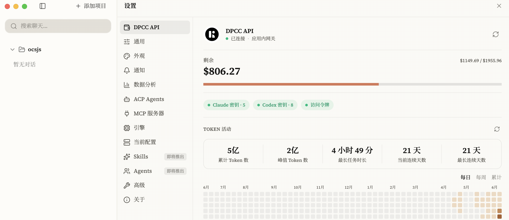
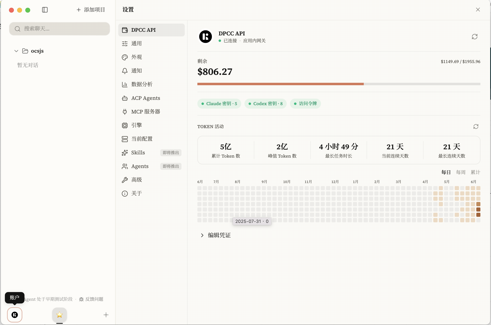
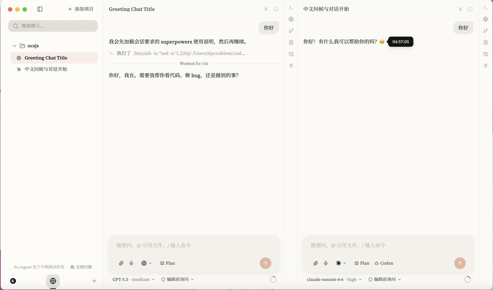
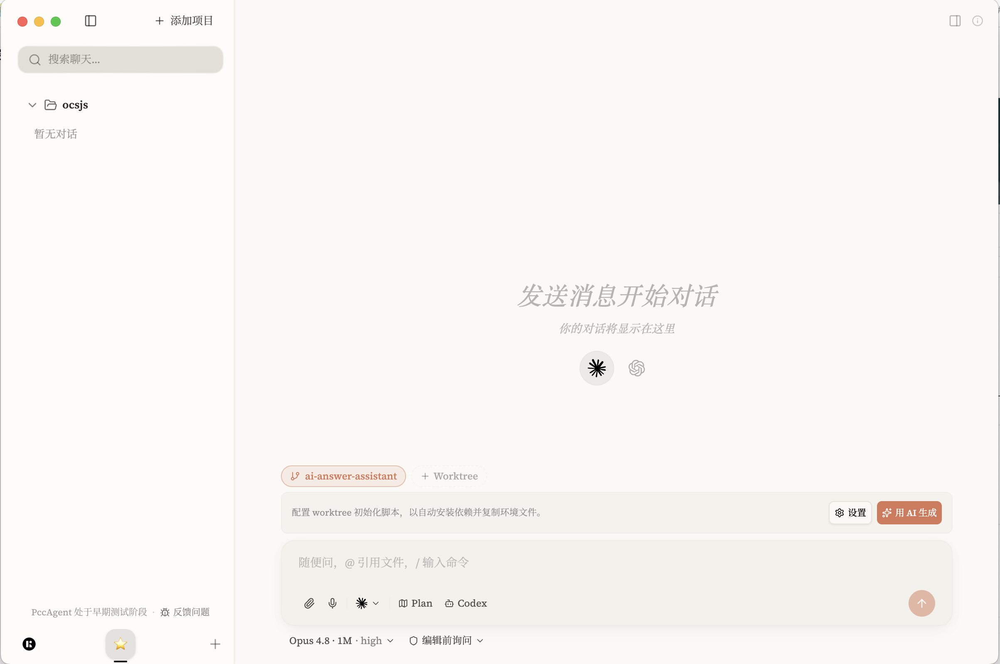

<p align="center">
  
</p>

<h1 align="center">PccAgent · DPCC API</h1>

<p align="center">
  <strong>一个桌面客户端，驾驭你的 AI 编程助手 —— 由 DPCC API 提供算力支持。</strong>
</p>

<p align="center">
  <a href="https://api.dpccgaming.xyz">DPCC API 平台</a>
  ·
  <a href="https://dpccgaming.xyz/payment">充值</a>
  ·
  <a href="docs/快速上手-连接DPCC-API.md">快速上手</a>
</p>

<p align="center">
  
  
  
</p>

> [!WARNING]
> PccAgent 仍在早期开发阶段，出现问题是正常的。欢迎在 Issues 中反馈 bug 与建议。

---

PccAgent 是一个跨平台桌面应用，让你在**同一个界面**里运行、管理 Pi 与自定义 ACP agent。新建会话统一使用 ACP；升级后仍可查看和管理历史 Claude/Codex 会话，但不会重新启动已移除的旧 runtime。

内置 Pi 默认通过 **DPCC API 网关**调用上游能力：使用浏览器登录并授权当前设备即可开始，余额、模型、用量统计一目了然。Custom ACP agent 则按各自定义和凭据运行。

**为什么选择 PccAgent？**

- **由 DPCC API 驱动。** 浏览器授权连接当前设备，Pi 通过 ACP 使用可用的上游模型，应用内查看余额、模型和 Token 用量。
- **一个应用，统一协议。** Pi 与自定义 ACP agent 可以并排运行，切换工作区时保留会话上下文。
- **看清 AI 在做什么。** 工具调用渲染为可交互卡片，带词级 diff、语法高亮和内联 bash 输出 —— 而不是一堆原始 JSON。
- **你的工作区，你做主。** 内置终端、浏览器、git、MCP 服务器和文件面板，全部按项目隔离，并在工作时保持常开。

### 项目方向

Pi 是 PccAgent 唯一内置并持续演进的 live Agent。后续新增的 model、thinking、permission、tool、Skill、MCP、session recovery 和进程管理能力，默认先完整适配 Pi，并通过通用 ACP contract 向 custom ACP agent 开放。项目不会恢复 Claude Code 或 Codex 的 live runtime；相关名称只会出现在历史会话兼容、迁移说明和归档文档中。

---

## 截图

<p align="center">
  
  <br />
  <em>内置 DPCC API 账户面板 —— 余额、可用模型与 Token 活动一目了然。</em>
</p>

<p align="center">
  
  <br />
  <em>通过浏览器安全登录并授权当前设备，支持余额与每日用量热力图。</em>
</p>

<p align="center">
  
  <br />
  <em>多个 agent 会话并排运行 —— 即时切换，不丢失进度。</em>
</p>

<p align="center">
  
  <br />
  <em>项目化工作区，配合 worktree、计划模式与 AI 答案助手。</em>
</p>

---

## 连接 DPCC API

PccAgent 的 Pi 会话通过 **DPCC API 网关**获取上游能力。应用不再要求手工复制 API 密钥。

1. 在 PccAgent 中点击**使用浏览器登录**。
2. 在系统浏览器登录 [DPCC API 平台](https://api.dpccgaming.xyz)，确认设备信息后授权。
3. 返回 PccAgent；账户状态变为**已连接**后即可启动 Pi ACP 会话。
4. 暂时不连接账户时，可选择**不登录并继续**，使用本地或自定义网关配置。

浏览器授权签发的设备凭据仅写入操作系统安全存储，不会显示在应用界面。退出时选择**退出并撤销此设备**会撤销服务器端授权。

完整步骤见 **[快速上手教程](docs/快速上手-连接DPCC-API.md)**。充值入口：<https://dpccgaming.xyz/payment>。

---

## 功能特性

### Pi 与 ACP 会话

Pi 是唯一内置 Agent，通过 `pi-acp` 和 ACP 运行。自定义 ACP agent 仍可安装和并行使用；每个会话拥有独立的状态、历史和上下文。

### 丰富的工具可视化

每次工具调用都渲染为可交互卡片。文件编辑展示带语法高亮的词级 diff，bash 输出内联显示，子 agent 任务嵌套展示逐步进度，文件变更按轮次汇总到专门的 Changes 面板。

### MCP 服务器管理

按项目通过 stdio、SSE 或 HTTP 传输连接任意 MCP 服务器，自动处理 OAuth 流程。服务器状态与可用工具数量一目了然。Jira、Confluence 等集成以专属 UI 呈现，而非原始 JSON。

### Git 集成

无需离开应用即可暂存、取消暂存、提交和推送。浏览分支、查看提交历史、管理 git worktree。可基于暂存 diff 由 AI 生成提交信息。

### 内置终端与浏览器

基于原生 shell 进程的多标签 PTY 终端。内嵌浏览器可内联打开 URL 并为 agent 提供额外上下文。两个面板在工作时保持挂载。

### 项目工作区与 Spaces

项目对应磁盘上的文件夹。Spaces 可将项目组织为带自定义图标和颜色的命名分组。会话、历史和面板设置都按项目隔离。

### Agent Store

直接在应用内浏览并安装来自 ACP 社区注册表的 agent。也可通过指定命令、参数、环境变量和图标添加自定义 agent。所有配置都在设置中管理 —— 无需手动改配置文件。

### 计划与权限控制

ACP agent 自己提供 model、thinking、command 和 permission config；Pi 的权限边界由 ACP 配置和当前会话模式共同决定。

### 长任务与工具状态

ACP 工具调用、权限请求、计划和上下文用量会在会话中持续显示；历史任务 transcript 仍可只读查看。

### 图片附件与标注

可在聊天中直接附加截图或图片。内置标注工具支持在发送前对图片进行手绘、高亮和标记。

### 语音输入与通知

支持原生 macOS 听写或设备端 Whisper 模型（无需 API key）的语音输入。可配置的系统通知覆盖计划审批、权限请求、agent 提问和会话完成。

### 会话搜索与历史

跨会话标题与消息内容的全文搜索。可导入此前在 Claude Code CLI 中开始的对话；导入内容属于历史记录，不会恢复 Claude runtime。

---

## 快速开始

1. **连接 DPCC API** —— 使用浏览器登录并授权设备（见上方[连接 DPCC API](#连接-dpcc-api)）。
2. **打开项目** —— 将 PccAgent 指向磁盘上的任意文件夹。
3. **选择 Agent** —— Pi 或任意已安装的自定义 ACP agent —— 开始工作。

---

## Agent 与 Runtime

PccAgent 的 live session 统一通过 ACP 调用：

| Agent | 协议 | 要求 |
|--------|----------|--------------|
| **Pi** | Agent Client Protocol | PccAgent 随包提供的离线 runtime，以及可用的模型/凭据 |
| **Custom ACP agents** | Agent Client Protocol | 按 agent 定义提供命令和依赖 |

内置 Pi 固定使用安装包内锁定版本的 `pi` 与 `pi-acp`，不调用系统 PATH 中的同名命令，也不会在首次运行时下载 runtime。本地模式仍会读取用户已有的 Pi 配置与 provider 凭据。若需要运行用户自行安装的 Pi executable，请使用不同 Agent ID 手动添加 custom ACP Agent；它与受保护的内置 Pi 相互独立。其他 ACP agent 可在应用内从 [ACP Agent Registry](https://agentclientprotocol.com/get-started/registry) 安装，或手动配置。

**可安装的 ACP 兼容 agent 示例：**

| Agent | 命令 | 说明 |
|-------|---------|-------|
| [Gemini CLI](https://github.com/google-gemini/gemini-cli) | `gemini --experimental-acp` | 实验性 ACP 开关 |
| [Goose](https://github.com/block/goose) | `goose acp` | |
| [Docker cagent](https://github.com/docker/cagent) | `cagent acp agent.yml` | 基于容器的 agent |

### 添加 agent

打开**设置 → ACP Agents**。**Agent Store** 标签页可浏览并安装社区注册表中的 agent。**My Agents** 标签页可创建自定义 agent —— 设置二进制命令、参数、环境变量和图标，或粘贴 JSON 定义自动填充表单。

### Pi Runtime

安装 PccAgent 后，内置 Pi runtime 即可离线启动，无需另装 `pi`、`pi-acp` 或 Node。「设置 → SDK」会显示 bundled source、离线就绪状态、实际版本和锁定版本；若随包资源缺失或损坏，应重新安装/更新 PccAgent，而不是全局安装 npm package。PccAgent 不会把旧 Claude/Codex 的 resume ID 转换成 Pi 的 `agentSessionId`。旧会话在迁移期保持只读，使用 Pi 请新建会话。

新建或尚未恢复的 Pi session 不会仅为了显示界面就启动子进程：model/thinking 使用缓存立即显示，`/` 命令会从内置命令、本地 Prompt/Skill 和缓存中提前加载。首次真正发送消息时才启动或恢复 Pi，再由 live ACP 结果校正缓存。

---

## MCP 服务器

MCP 服务器在右侧工具栏的 **MCP 服务器面板**中按项目配置。支持的传输方式：stdio、SSE 和 HTTP。OAuth 认证在应用内完成，令牌跨会话持久化。

---

## 安装

> [!NOTE]
> 预构建的二进制目前**未签名**。在 macOS 上首次启动时，右键点击应用并选择**打开**以绕过 Gatekeeper 警告。在 Windows 上，如被 Windows Defender 拦截，点击**更多信息 → 仍要运行**。

| 平台 | 下载 |
|----------|----------|
| macOS (Apple Silicon) | `.dmg` (arm64) |
| macOS (Intel) | `.dmg` (x64) |
| Windows (x64) | `.exe` 安装程序 |
| Windows (ARM64) | `.exe` 安装程序 |
| Linux | `.AppImage` / `.deb` |

---

## 开发

```bash
pnpm install
pnpm dev
```

`pnpm dev` 启动 Vite、Electron main watch 和 Electron。开发态与安装包都使用仓库锁定的 bundled Pi runtime，不读取系统 PATH 中的同名命令，也不会在首次运行时下载 runtime。可用 `pnpm pi:runtime:check` 检查 Pi、`pi-acp`、MCP adapter、Electron host、版本锁定和离线策略。

### 测试

```bash
pnpm test
pnpm typecheck
pnpm build
pnpm test:pi-integration
pnpm test:electron-recovery
pnpm test-map:check
pnpm docs:check
```

Pi child integration 和 Electron recovery 会使用临时目录，不读取真实用户会话。发布安装包由 CI quality gate 负责，不把本机旧产物当作验证结果。
`.github/workflows/quality.yml` 暴露稳定 check name `quality`；仓库管理员仍需在
`master` 的 branch protection/ruleset 中将它设为 required status check，workflow
文件本身不能替代这项 GitHub repository setting。

### 构建安装包

```bash
pnpm dist:mac      # macOS DMG (arm64 + x64)
pnpm dist:win      # Windows NSIS 安装程序 (x64 + ARM64)
pnpm dist:linux    # Linux AppImage + deb
```

---

## 贡献

1. Fork 仓库并创建特性分支
2. 遵循 `CLAUDE.md` 中的约定
3. 用 `pnpm dev` 测试
4. 提交 Pull Request

---

## 许可证

MIT

---

<p align="center">
  由 <a href="https://api.dpccgaming.xyz">DPCC API</a> 提供支持 · 基于 <a href="https://agentclientprotocol.com">Agent Client Protocol</a> 构建
</p>
